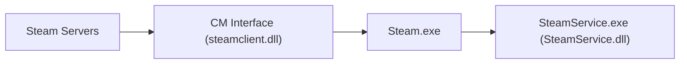

This note explains how VAC (Valve Anti-Cheat) operates.

Stages:
1. An event is sent to the Steam server when a VAC-protected game is launched.
2. The server sends a self-decrypting session initialization module, which is passed to SteamService.
3. SteamService executes the session initialization module and sends data back to the Steam server. This data includes system information and other related details.
4. After session initialization, the Steam server periodically sends additional modules, such as controller scans, process scans, and module scans.

---
### See also

---
### References
